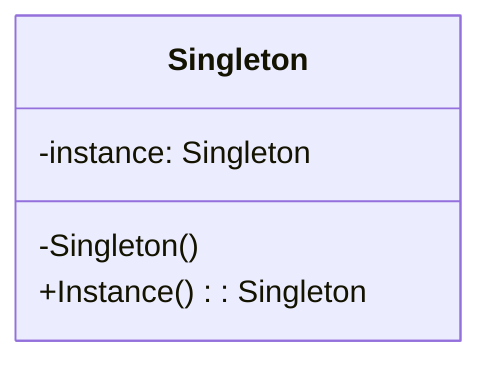

## Introduction👋

Senior full-stack developer with over 20 years of experience. Continually improving skills, currently focusing on Angular, DevOps, and C# LeetCode practice and system design challenges.  
 

## Skill Matrix :hammer:
| Skill      | Level |
| :-----------| -----: |
| C# | :star::star::star::star::star: |
| GIT | :star::star::star::star::star: |
| Angular | :star::star::star::star: |
| JavaScript | :star::star::star::star: |
| MVC | :star::star::star::star: |
| EF | :star::star::star::star: |
| Java | :star::star::star: |
| MSSQL | :star::star::star: |
| Azure | :star::star::star: |
| AWS | :star::star::star: |
| TypeScript | :star::star::star: |
| Docker | :star::star::star: |
| Kubernetes | :star::star: |
| NodeJS | :star::star: |
| SASS | :star::star: |
 

## Highlighted Projects :bulb:

### Angular
3 years of work experience, all hosted on GitHub under the Government of BC, and the following hobby projects:
- [Shared Library/Blog](https://github.com/jburditt/fullswing-angular-library)
- [Bootstrap/Demo/OAuth](https://github.com/jburditt/Angular-Bootstrap)
- [Gamify Workout](https://github.com/jburditt/GamifyWorkout)

### C#
20 years of work experience, some hobby projects:
- [LeetCode Submissions](https://github.com/jburditt/Leet-Code)
- [EF Core + Odata](https://github.com/jburditt/Angular-Bootstrap/tree/main/Api)

### React
- [Demo](https://github.com/jburditt/react-demo)

### Azure
3 years of work experience and training

 

## Let's Connect :sunglasses:
[LinkedIn](https://www.linkedin.com/in/jburditt/)
